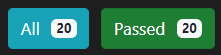

# Twitter-clone
## Task 1
An example of this can be found in the [Docker Compose](./docker-compose.yml)

## Task 2
The 2 Implemented files can be found here:
- [PostManagementImpl](./src/main/java/dk/cphbusiness/mrv/twitterclone/impl/PostManagementImpl.java)
- [UserManagementImpl](./src/main/java/dk/cphbusiness/mrv/twitterclone/impl/UserManagementImpl.java)

#### Test Results:


## Task 3
My implementation is using Redis Hashes which is maps between string fields and string values, so they are the perfect data type to represent objects. For following between users the implementation uses Redis sets which are an unordered collection of Strings.

### users hashes:
```
user#<username>
    username = username
    firstname = firstname
    lastname = lastname
    passwordHash = passwordHash
    birthday = birthday
-------------------------------
user#ahr
    username = ahr
    firstname = Albert
    lastname = Rumle
    passwordHash = aou87
    birthday = 1951-03-03
```

### following set:
```
following#<username> = [followingUsernames]
---------------------------------------
following#ahr = [ben,crl,den]
following#ben = [den]
following#den = [den,crl]
```

### followers set:
```
followers#<username> = [followersUsername]
followers#ahr = [ben,crl,den]
followers#ben = [den]
followers#den = [den,crl]
```

### posts hashes:
```
posts#<username>
    timestamp = message
------------------------
posts#ahr
    150 = this is a post created at 150 by ahr
    350 = this is a post created at 350 by ahr
    200 = this is a post created at 200 by ahr
    300 = this is a post created at 300 by ahr
```
